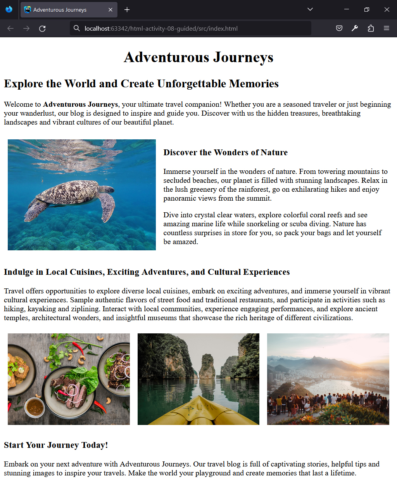

## HTML | Activity #8 (Guided): Images
In this activity, we will create a **Travel Blog Page** with the following content:




### Development Setup
Create your `index.html` file inside the [**src**](/src) folder in this project,
then follow along with this guide.

To test your output, simply open it in your preferred web browser.


### Template
First, we need a regular HTML template that already contains the headers and paragraphs.


We will leave [comments](https://www.w3schools.com/html/html_comments.asp) for the parts that we will do later.

```html
<!DOCTYPE html>
<html lang="en">
<head>
    <meta charset="UTF-8">
    <title>Adventurous Journeys</title>
</head>
<body>
    <div class="intro">
        <h1 align="center">Adventurous Journeys</h1>

        <h2>Explore the World and Create Unforgettable Memories</h2>
        <p>
            Welcome to <b>Adventurous Journeys</b>, your ultimate travel companion!
            Whether you are a seasoned traveler or just beginning your wanderlust,
            our blog is designed to inspire and guide you.
            Discover with us the hidden treasures,
            breathtaking landscapes and vibrant cultures of our beautiful planet.
        </p>
    </div>

    <div class="discover" align="center">
        <table cellspacing="0" cellpadding="8" width="100%">
            <tr>
                <td width="40%" align="center">

                    <!-- image: Discover the Wonders of Nature -->

                </td>
                <td width="60%">
                    <h3>Discover the Wonders of Nature</h3>
                    <p>
                        Immerse yourself in the wonders of nature.
                        From towering mountains to secluded beaches,
                        our planet is filled with stunning landscapes.
                        Relax in the lush greenery of the rainforest,
                        go on exhilarating hikes and enjoy panoramic views from the summit.
                    </p>
                    <p>
                        Dive into crystal clear waters,
                        explore colorful coral reefs and see amazing marine life
                        while snorkeling or scuba diving.
                        Nature has countless surprises in store for you,
                        so pack your bags and let yourself be amazed.
                    </p>
                </td>
            </tr>
        </table>
    </div>

    <div class="indulge">
        <h3>Indulge in Local Cuisines, Exciting Adventures, and Cultural Experiences</h3>
        <p>
            Travel offers opportunities to explore diverse local cuisines,
            embark on exciting adventures,
            and immerse yourself in vibrant cultural experiences.
            Sample authentic flavors of street food and traditional restaurants,
            and participate in activities such as hiking, kayaking and ziplining.
            Interact with local communities, experience engaging performances,
            and explore ancient temples, architectural wonders, and insightful museums
            that showcase the rich heritage of different civilizations.
        </p>

        <table cellspacing="0" cellpadding="8" width="100%">
            <tr>
                <td width="33.33%" align="center">

                    <!-- image: Local Cuisines -->

                </td>
                <td width="33.33%" align="center">

                    <!-- image: Exciting Adventures -->

                </td>
                <td width="33.33%" align="center">

                    <!-- image: Cultural Experiences -->

                </td>
            </tr>
        </table>
    </div>

    <div class="start-journey">
        <h3>Start Your Journey Today!</h3>
        <p>
            Embark on your next adventure with Adventurous Journeys.
            Our travel blog is full of captivating stories,
            helpful tips and stunning images to inspire your travels.
            Make the world your playground and create memories that last a lifetime.
        </p>
    </div>
</body>
</html>
```

For now, we utilize `<table>` elements to define the layout of our webpage.
A table spans the entire width of the page,
and the divided width of the `<td>` elements essentially determines
the space taken up by their content.
To hide the table borders, we leave the `border` attribute unspecified.


### Defining Images
To create an image, we use the `` tag.
Its required attribute is `src`,
where we indicate the complete **URL** or **file path**
of the image we want to show on the page.

**Example:**
```html

```

<small>
The <code>&lt;img/&gt;</code> tag is a self-closing tag, just like <code>&lt;br/&gt;</code> and <code>&lt;hr/&gt;</code>.
</small>

#### Discover the Wonders of Nature


In this project, all images are stored in the [**/src/img**](/src/img) folder.
To use them, just create an `` tag with the `src` attribute pointing to one of those image files.

In this section, we will use [**img/discover-the-wonders-of-nature.jpg**](img/discover-the-wonders-of-nature.jpg).

```html
                    ...
                    
                    <!-- image: Discover the Wonders of Nature -->
                    
                    
                    ...
```

To maintain clean and compact code,
we format the `` code on multiple lines,
and we included two additional attributes:

| Attribute | Description                                                                                                                        |
|-----------|------------------------------------------------------------------------------------------------------------------------------------|
| `width`   | set to `"100%"` to make the image fill the full width of its containing element                                                    |
| `alt`     | provides an "alternative text" for the image, aiding accessibility and describing the image's content for users who cannot see it. |

#### Indulge in Local Cuisines, Exciting Adventures, and Cultural Experiences


***TODO***:
Complete this **Travel Blog Page** by defining these three remaining images:
1. [**img/local-cuisines.jpg**](src/img/local-cuisines.jpg)
2. [**img/exciting-adventures.jpg**](src/img/exciting-adventures.jpg)
3. [**img/cultural-experiences.jpg**](src/img/cultural-experiences.jpg)
